# FormMitra

**Fill Indian government forms by voice, in your own language. Works offline.**

A Progressive Web App that helps citizens who cannot read bureaucratic English
fill government forms — explaining each field in plain Hindi, asking one
question at a time by voice, validating deterministically, and producing a
printable filled PDF that never leaves the phone.

Smart India Hackathon 2026. Team of 6 first-year CSE students.

**Try it: [formmitra-cyan.vercel.app](https://formmitra-cyan.vercel.app)** —
nothing to install. Open it on a phone in Chrome, since the microphone needs
Chrome's Web Speech support.

> **Prototype.** Built in one day to see the whole thing standing up end to end.
> It works — the complete nine-step flow runs, offline included — but read
> `docs/build-log/06-verification.md` for what has and has not been tested.

---

## What it looks like

Every screenshot below is the real app, captured at phone size while walking the
full flow. The default language is Hindi.

### The nine-step journey

<table>
<tr>
<td width="33%">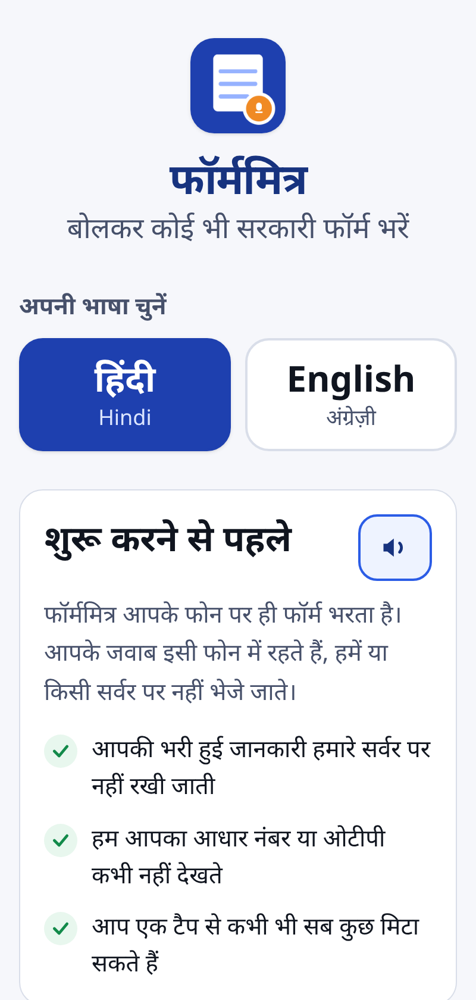</td>
<td width="33%">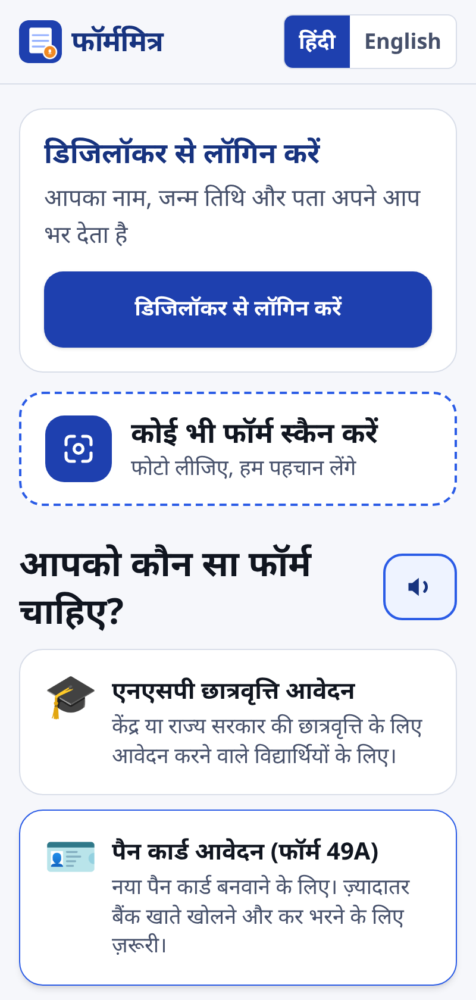</td>
<td width="33%">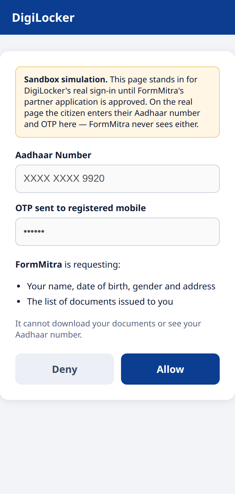</td>
</tr>
<tr>
<td><b>1. Consent + language</b><br>Consent comes before any data is touched, per the DPDP Act. Doubles as the language chooser, since that is the one thing a citizen can do before they can read anything else.</td>
<td><b>2. Pick a form</b><br>Ten forms, or scan one you are holding. Every heading can be heard aloud.</td>
<td><b>3. DigiLocker login</b><br>Aadhaar and OTP are entered on DigiLocker's own page. FormMitra never sees either.</td>
</tr>
</table>

<table>
<tr>
<td width="33%">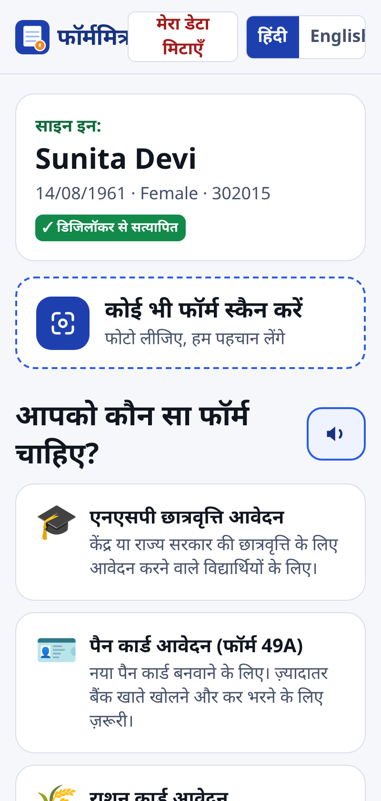</td>
<td width="33%">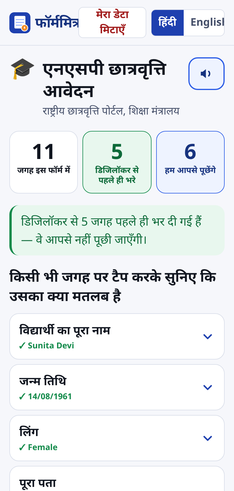</td>
<td width="33%">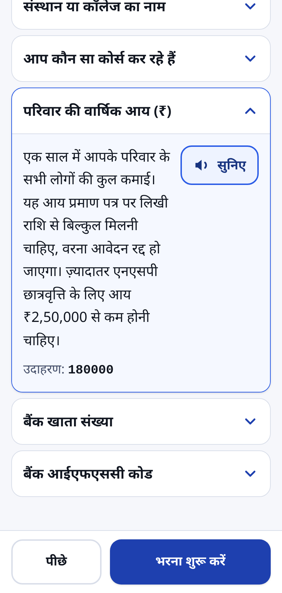</td>
</tr>
<tr>
<td><b>4. Verified profile</b><br>Name, DOB, gender and address arrive verified and auto-fill across every form.</td>
<td><b>5. What you will be asked</b><br><b>11 fields, 5 already filled, 6 questions.</b> DigiLocker removed nearly half the work before a single question was asked.</td>
<td><b>6. Tap to understand</b><br>The bit a cyber-café agent charges ₹50 for. Pre-written, human-reviewed, and spoken aloud — no model involved.</td>
</tr>
</table>

<table>
<tr>
<td width="33%">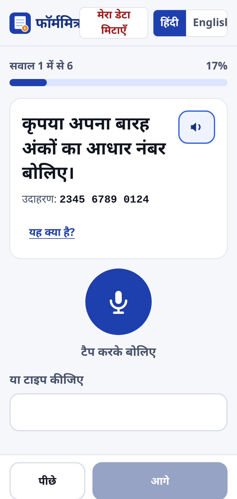</td>
<td width="33%">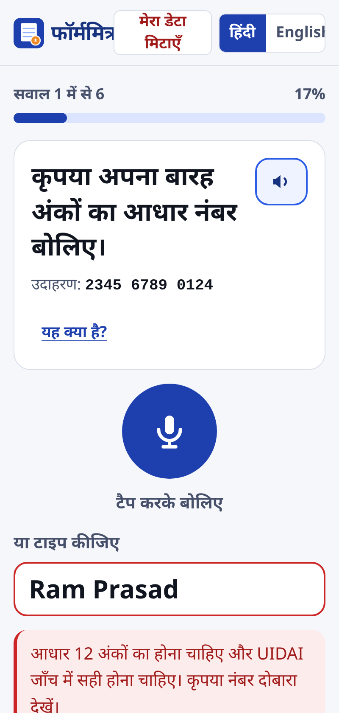</td>
<td width="33%">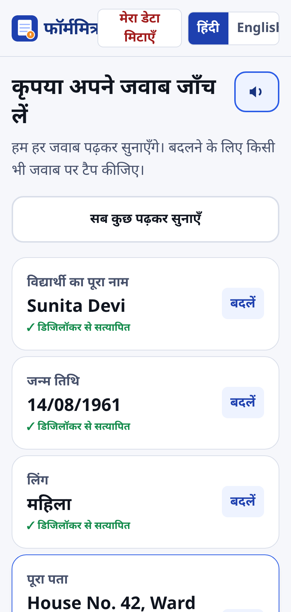</td>
</tr>
<tr>
<td><b>7. One question at a time</b><br>Spoken automatically on arrival. The text box below the mic is always live — voice is an accelerator, never a requirement.</td>
<td><b>8. Validation that cannot be wrong</b><br>Pure regex and the real UIDAI checksum. The reason is <i>spoken</i> in Hindi, not just shown in red to someone who cannot read it.</td>
<td><b>9. Read back for checking</b><br>Aadhaar comes back as "2 3 4 5, 6 7 8 9, 0 1 2 4" — checkable by ear. Tap any answer to change it.</td>
</tr>
</table>

### Checklist, output, and English

<table>
<tr>
<td width="33%">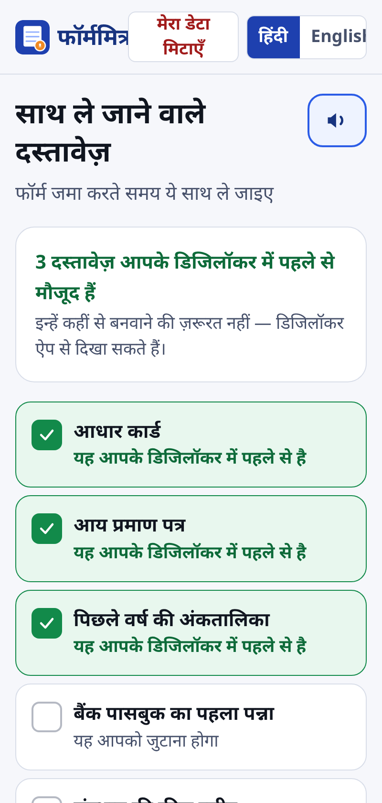</td>
<td width="33%">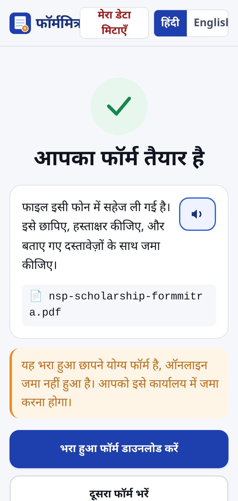</td>
<td width="33%">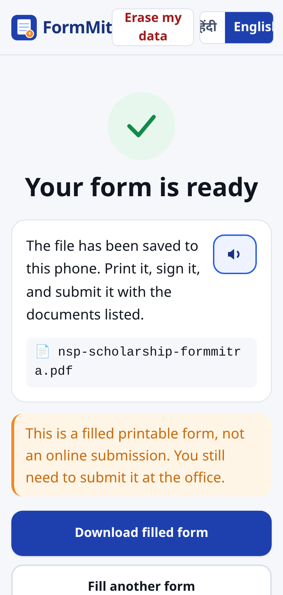</td>
</tr>
<tr>
<td><b>Documents to carry</b><br>Cross-referenced against DigiLocker: <b>3 of these 6 are already held</b>, so the citizen is not sent to a tehsil office for something they already have.</td>
<td><b>Saved to the device</b><br>Generated in the browser and never uploaded. Carries a standing warning that this is a printable form, not an online submission.</td>
<td><b>Both languages throughout</b><br>Every string, explanation, question and error message exists in Hindi and English.</td>
</tr>
</table>

### The form it produces

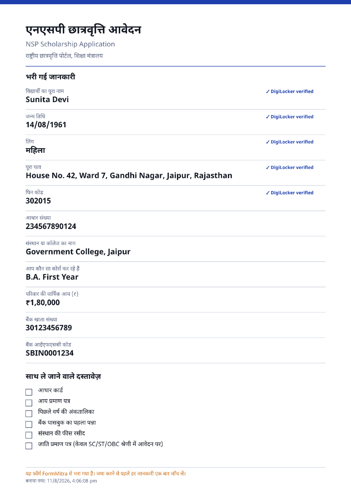

Generated entirely in the browser by pdf-lib, saved straight to the phone.
DigiLocker-sourced fields are marked verified, the amount is formatted in Indian
grouping, and the document checklist is printed with tick boxes.
[Download the real file](docs/screenshots/sample-filled-form.pdf).

### With the network switched off

The service worker caches the app, all ten templates, every explanation, the OCR
model and the PDF engine on first visit. From the second visit, none of this
needs a connection:

```
2. Network OFF — everything below runs from the device
  ok   app loads with no network
  ok   form template opened (bundled, not fetched)
  ok   pre-written explanation available offline
  ok   validation ran offline, reached confirm
  ok   checklist works offline
  ok   done screen reached offline
  downloaded offline: ration-card-formmitra.pdf

  (0 network requests were refused while offline)
```

Only DigiLocker login needs internet, and it says so rather than failing
silently.

---

## Run it

You need two terminals.

```bash
# Terminal 1 — API
uv run main.py                # http://127.0.0.1:8000

# Terminal 2 — app
cd frontend
npm install                   # first time only
npm run dev                   # http://localhost:5173
```

Open **http://localhost:5173**.

> **Use Chrome or Edge.** Firefox has no Web Speech recognition, so the mic
> button will be disabled. Everything else works, but the voice demo needs
> Chrome.

### Testing offline mode

The service worker is disabled in `npm run dev`. To see the offline behaviour:

```bash
cd frontend
npm run build && npm run preview
# load the page once, then switch off Wi-Fi and reload
```

---

## Deploying

The app and the API deploy together as one Vercel project — two services on one
domain, defined in `vercel.json`. Because they share an origin, the frontend's
relative `/api` calls, the redirect back from DigiLocker login, and CORS all
work with no configuration.

```bash
npx vercel@latest --prod          # CLI 58+ is required; older ones reject `services`
```

No environment variables are needed for a mock-mode deploy. Two are worth
knowing about:

| | |
|---|---|
| `FORMMITRA_SECRET_KEY` | Signs the mock provider's session tokens. Optional — the fallback protects nothing today — but set it so tokens from one deployment are not accepted by another. |
| `GEMINI_API_KEY` | Only enables V1 generic mode. Unset, generic mode returns a `503` and template mode is unaffected. |

**Share the production URL, not a preview one.** Preview deployments sit behind
Vercel authentication, which your testers will not have.

**Deploying is what makes phone testing possible.** The microphone and camera
need a secure origin, so a LAN IP address never worked — HTTPS is the thing that
unlocks them.

> **One caveat, and it is a real one.** Serverless does not keep memory between
> requests, so the mock DigiLocker provider signs its tokens instead of storing
> them. The **live** DigiLocker path still uses an in-memory session store and
> therefore cannot run on serverless — `/api/health` reports this as
> `needs_session_store`, and login refuses rather than failing intermittently.
> Going live needs Redis or an HttpOnly-cookie session first.
> `docs/build-log/11-deploying.md` explains why signing the real tokens would
> have been the wrong fix.

---

## What works today

- **10 form templates** — NSP scholarship, PAN Form 93, ration card, pension
  life certificate, bank KYC, Ayushman, income certificate, caste certificate,
  LPG subsidy, RTI. 94 fields, every one with a hand-written Hindi *and*
  English explanation.
- **DigiLocker login** — real OAuth 2.0 + PKCE against the Partner API, with a
  mock provider standing in until partner credentials arrive. Fills 39 of the
  94 fields automatically.
- **Voice fill** — Web Speech API, Hindi and English, one question at a time,
  with a typing fallback that is always available.
- **Deterministic validation** — 12 regex/arithmetic rules including the real
  UIDAI Aadhaar checksum. No model involved, so a verdict cannot be hallucinated.
- **Camera scan + OCR** — Tesseract.js in the browser, identifying the form from
  keyword matching against the templates.
- **The real government form, filled** — for PAN Form 93, answers are stamped
  into the department's own PDF, one character per box. Every cell coordinate
  was read out of the form's vector strokes, not measured by hand. Anything we
  cannot place with confidence is left blank and reported to the citizen rather
  than guessed.
- **Filled PDF** — generated by pdf-lib in the browser, saved to the device,
  never uploaded.
- **Fully offline** — verified: the whole template flow runs with the network
  switched off.

---

## Layout

```
FormMitra/
├── main.py                    # starts the API
├── backend/
│   ├── main.py                # FastAPI app + endpoints
│   ├── digilocker.py          # OAuth 2.0 + PKCE, and the mock provider
│   └── validation.py          # server-side mirror of the rules
├── frontend/src/
│   ├── App.jsx                # flow control
│   ├── screens/               # the 8 screens
│   ├── components/ui.jsx      # shared UI, all 56px+ tap targets
│   ├── lib/
│   │   ├── validation.js      # the rules that actually run
│   │   ├── speech.js          # Web Speech API + spoken-input normalisation
│   │   ├── ocr.js             # Tesseract pipeline
│   │   ├── pdf.js             # the summary sheet, in the citizen's language
│   │   ├── officialPdf.js     # stamping answers into the government's own form
│   │   └── i18n.js            # every UI string, both languages
│   ├── data/forms/            # the 10 templates ← the actual product
│   └── data/official/         # box coordinates for the real government forms
└── docs/
    ├── build-log/             # what was built, and why
    └── screenshots/           # every screen + a sample generated PDF
```

---

## The design decisions that matter

**Template mode uses no LLM at all.** All explanations are pre-written and
human-reviewed; all validation is regex. This is why we can tell judges that
hallucination is impossible in the core flow, rather than merely unlikely.
Gemini appears only in V1 generic mode, for unrecognised forms, behind a visible
"AI-generated" warning.

**Templates are bundled into the frontend, not served by the API.** Offline is
non-negotiable, and a fetch would break it.

**The backend exists for exactly one thing the browser cannot do:** exchanging
the DigiLocker authorisation code for a token, which needs the client secret.

**A summary sheet is not a filled form.** Handing the citizen a tidy list of
their answers still leaves them copying every value into the government's boxes
in English block capitals — the exact task they came to us unable to do. So
where an official blank exists we stamp the department's own PDF and make that
the headline output; the summary sheet stays as the record they can read.

**Never write a guess into a government form.** Anything that cannot be placed
with confidence is left blank and reported back in the citizen's language. A
blank box is an inconvenience; a wrong box is a rejected application weeks
later with no explanation.

**The PDF is laid out on a canvas.** pdf-lib can embed fonts but cannot *shape*
text, and Devanagari needs shaping. Letting the browser lay out the page
guarantees correct Hindi on the one artefact the citizen physically carries.

---

## Going live with DigiLocker

No code changes. Set three environment variables:

```bash
export DIGILOCKER_CLIENT_ID=...
export DIGILOCKER_CLIENT_SECRET=...
export DIGILOCKER_REDIRECT_URI=https://<our-domain>/api/digilocker/callback
```

Check which mode you are in: `curl localhost:8000/api/health`

---

## Read next

`docs/build-log/` — one file per build step, covering what was built, why, what
broke, and what is still missing:

| | |
|---|---|
| `01-scaffolding.md` | Project setup, PWA config, design tokens |
| `02-backend-digilocker.md` | OAuth flow explained, validation rules |
| `03-form-templates.md` | The template schema and how to add an 11th form |
| `04-core-libraries.md` | Voice, validation, OCR, PDF — and two nasty bugs |
| `05-screens.md` | The eight screens and the accessibility rules behind them |
| `06-verification.md` | What was actually tested, and what was not |
| `07-official-form-geometry.md` | Reading ~950 box coordinates out of the official PDF |
| `08-official-form-overlay.md` | Stamping answers into the government's own form |
| `09-wiring-and-form-93.md` | Form 49A → Form 93, and two bugs that would have broken the demo |
| `10-sourcing-the-other-blanks.md` | Which of the other nine forms can be filled, and which have no paper form at all |
| `11-deploying.md` | Going live on Vercel, and the in-memory session bug serverless forced us to fix |
